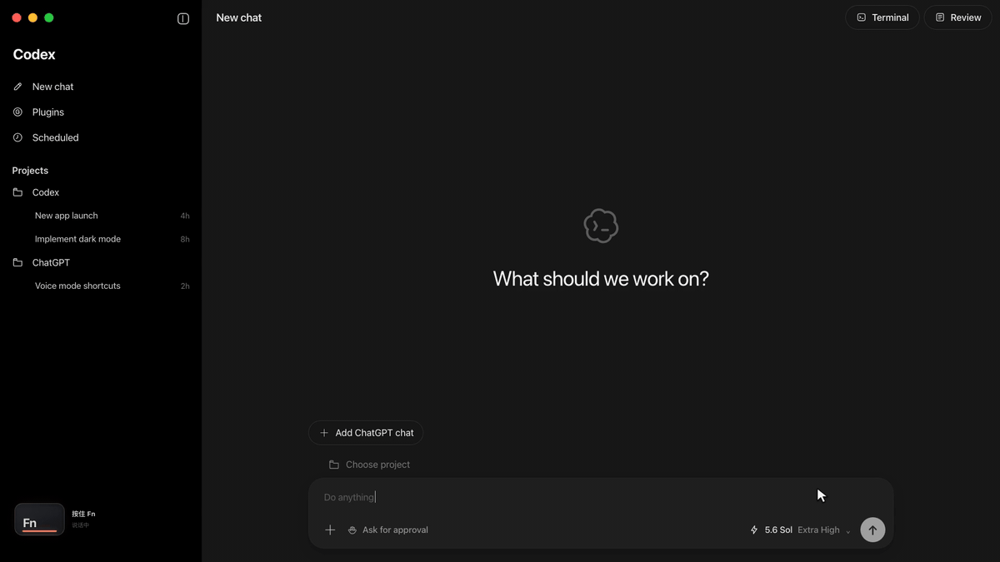
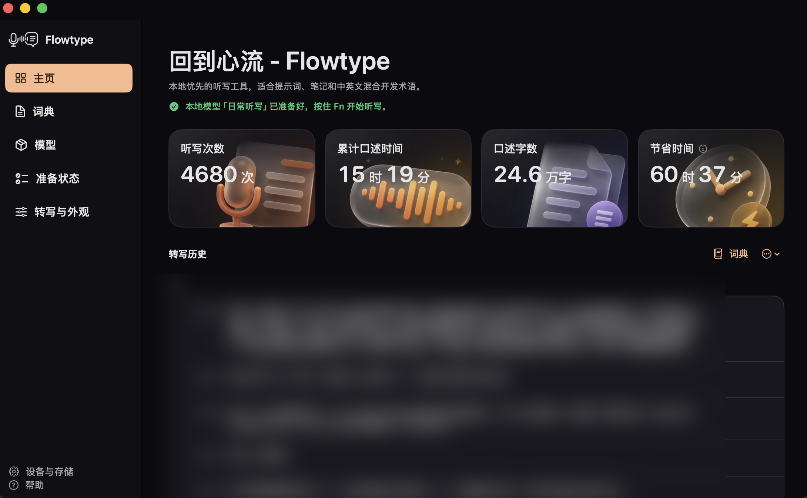

# Flowtype

English · [简体中文](README.md)

> **Release status:** The [`v0.1.0-preview.3`](https://github.com/smgonthebeat/Flowtype/releases/tag/v0.1.0-preview.3) Apple Silicon DMG is available. It uses a local development signature and is **not signed with an Apple Developer ID or notarized by Apple**. macOS will block the first launch until the user explicitly chooses Open Anyway in System Settings → Privacy & Security.

<a href="https://github.com/smgonthebeat/Flowtype/releases/download/v0.1.0-preview.3/Flowtype.dmg">
  
</a>

[Verify SHA-256](https://github.com/smgonthebeat/Flowtype/releases/download/v0.1.0-preview.3/Flowtype.dmg.sha256) · [Release notes](https://github.com/smgonthebeat/Flowtype/releases/tag/v0.1.0-preview.3) · [GitHub Repository](https://github.com/smgonthebeat/Flowtype)

Flowtype is a local-first macOS dictation app. Hold `Fn` to speak, release it to transcribe locally, and the result is pasted into the app you were using. It is designed for real speech that mixes Chinese, English, technical terms, and spoken mathematics.



[▶ Watch with sound](https://github.com/smgonthebeat/Flowtype/releases/download/v0.1.0-preview.2/Flowtype-GitHub-Promo.mp4)

The Codex `New chat` view is a synthetic third-party input scene used only to demonstrate ordinary text pasting. It contains no real conversation, and its procedural soundtrack contains no real recording. It does not imply integration, affiliation, sponsorship, or endorsement by OpenAI.



This is not mock data. The author explicitly chose to publish this real-use capture from 2026-07-23: **4,680 dictations**, **15 hours 19 minutes** dictated, **246,000 characters** transcribed, and an estimated **60 hours 37 minutes** saved. The transcript-history rows are heavily blurred for privacy while the aggregate usage cards remain unchanged from the original capture. Flowtype was a tool used every day before it became an open-source project.

## Why Flowtype

General-purpose dictation often interrupts technical thought when languages, terminology, and mathematical notation appear in the same sentence. Flowtype aims to place what you already said at the cursor quickly and faithfully; it is not an automatic writing service.

## Highlights

- **Hold, speak, release, paste:** use `Fn` from the current app to record, transcribe, and paste.
- **Mixed language and terminology:** local Qwen3-ASR with user-controlled terminology context.
- **Spoken mathematics:** render mathematical expressions as Unicode or LaTeX.
- **Local-first:** the primary engine runs on Apple Silicon without a required cloud ASR subscription.
- **Recoverable failures:** History, up to three local retry recordings, model status, and diagnostics.
- **Native macOS workflow:** menu bar, recording capsule, permission onboarding, and model management.

## Requirements

- macOS 14 or later;
- an Apple Silicon Mac;
- Microphone and Accessibility permissions;
- Swift 5.9 or later only for developers building from source;
- several gigabytes of free storage and unified memory for the local model and runtime.

Clicking **Prepare Flowtype** for the first time confirms the download: Flowtype requests Microphone and Accessibility permissions, automatically downloads the approximately 1.9 GB default Qwen3-ASR 0.6B model from Hugging Face, and shows download/preparation progress. Accessibility must still be approved in System Settings; return to Flowtype and setup continues automatically. Model weights are not stored in this repository or bundled with the source archive.

## Getting Started

Ordinary users do not need Swift or a source checkout. Download `Flowtype.dmg` only from the official [`v0.1.0-preview.3` Release](https://github.com/smgonthebeat/Flowtype/releases/tag/v0.1.0-preview.3), open it, and follow the arrow to drag `Flowtype.app` to Applications.

This is an explicitly labelled **unnotarized Preview**. macOS will block the first double-click because it cannot verify the developer. Try to open Flowtype once and dismiss the warning, then open **System Settings → Privacy & Security**, choose **Open Anyway** in the Security section, and confirm Open. See Apple's official guide, [Open a Mac app from an unknown developer](https://support.apple.com/guide/mac-help/open-a-mac-app-from-an-unknown-developer-mh40616/mac). Do not disable Gatekeeper or run quarantine-removal or Gatekeeper-disabling commands.

The following commands are only for developers who want to inspect or modify the source:

```bash
swift test
uv run --project Helpers/qwen-asr-helper --frozen pytest
make build
```

`make build` creates a locally ad-hoc-signed development bundle at `.build/Flowtype.app`; it is not an official distribution build.

## Privacy, With Concrete Boundaries

- Qwen3-ASR transcription uses a local helper bound to `127.0.0.1` and protected by a per-session token.
- Apple Speech fallback runs only when on-device recognition is supported and sets `requiresOnDeviceRecognition`.
- Transcript History is stored locally, enabled by default, and defaults to 100 entries; it can be disabled or adjusted in Settings.
- With History enabled, up to three recent recordings are retained locally for manual retry; clearing History also clears those retry recordings.
- Model download is an explicit network operation. The website, source build, and routine local transcription have different network boundaries.

See [Privacy & Local Data](docs/PRIVACY.md) for details. Never attach real recordings, transcripts, credentials, or private diagnostics to an issue.

## Documentation

- [Installation & Source Builds](docs/INSTALL.md)
- [Privacy & Local Data](docs/PRIVACY.md)
- [Architecture](docs/ARCHITECTURE.md)
- [Troubleshooting](docs/TROUBLESHOOTING.md)
- [Changelog](CHANGELOG.md)
- [Contributing](CONTRIBUTING.md)
- [Security Policy](SECURITY.md)

The static product website lives in [`website/`](website/). It has no build step, analytics, cookies, external scripts, or runtime package dependencies. Its GitHub and DMG controls point to the official repository and Preview Release.

## License

Flowtype software and project-provided assets are licensed under [`GPL-3.0-only`](LICENSE) to the extent the project can grant those rights. Exceptions for third-party components, assets, and marks are documented in [THIRD_PARTY_NOTICES.md](THIRD_PARTY_NOTICES.md), [ASSET_PROVENANCE.md](ASSET_PROVENANCE.md), and [TRADEMARKS.md](TRADEMARKS.md).
