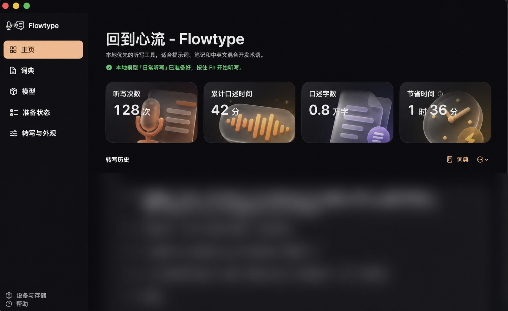

# Flowtype

[English](README.en.md) · 简体中文

> **Release status:** 首个公开版本正在准备中。源码已经进入公开前审阅阶段，预编译 DMG、checksum、signing 与 notarization 尚未发布。

Flowtype 是一款 local-first macOS 听写工具。按住 `Fn` 说话，松开后完成本地转写，并把结果粘贴到刚才使用的 App 中。它重点处理中文、English、technical terms 与 spoken mathematics 混合出现的真实口述场景。



## 为什么做 Flowtype

普通听写工具很容易在中英混说、专业名词和数学表达上打断思路。Flowtype 的目标不是替你写作，而是尽量忠实、快速地把你已经说出来的内容落到光标处。

## 主要能力

- **按住即说，松开即贴：** 在当前 App 中使用 `Fn` 完成录音、转写和粘贴。
- **中英混合与专业词汇：** local Qwen3-ASR 配合可自定义的 terminology context。
- **口述数学：** 可把数学表达转换成 Unicode 或 LaTeX。
- **local-first：** 主引擎在 Apple Silicon 本机运行；不要求 cloud ASR subscription。
- **失败可恢复：** History、最多三条本地 retry recordings、模型状态和 diagnostics 帮助定位问题。
- **原生 macOS 体验：** menu bar、recording capsule、permissions onboarding 与 model management。

## 系统要求

- macOS 14 或以上；
- Apple Silicon Mac；
- Microphone 与 Accessibility permissions；
- Swift 5.9 或以上（从源码构建时）；
- 数 GB 可用存储与 unified memory，用于本地模型和 runtime。

首次准备本地模型时，Flowtype 会在取得确认后从 Hugging Face 下载 Qwen3-ASR model files。模型权重不在本仓库中，也不包含在源码 archive 中。

## 开始使用

当前公开候选版本只提供 source build；已签名、notarized 的 DMG 尚未开放。请先阅读 [安装与源码构建说明](docs/INSTALL.md)，不要从非官方镜像下载所谓的 Flowtype release。

从 repository root 运行开发检查：

```bash
swift test
uv run --project Helpers/qwen-asr-helper --frozen pytest
make build
```

`make build` 会在 `.build/Flowtype.app` 生成本地 ad-hoc signed development bundle；它不等同于官方 distribution build。

## Privacy，不只是一句宣传语

- Qwen3-ASR transcription 通过仅监听 `127.0.0.1` 且带 session token 的本地 helper 完成。
- Apple Speech fallback 只有在设备支持 on-device recognition 时才会运行，并强制 `requiresOnDeviceRecognition`。
- Transcript History 默认在本机保存，默认上限为 100 条，可在 Settings 中关闭或调整。
- 启用 History 时，最近最多三条录音会保留在本机，供手动 retry；清空 History 同时清理这些 retry recordings。
- Model download 是明确的 network operation；website、source build 和日常 local transcription 不是同一件事。

完整说明见 [Privacy & Local Data](docs/PRIVACY.md)。提交 issue 时不要附上真实录音、transcript、credential 或 private diagnostics。

## 文档

- [安装与源码构建](docs/INSTALL.md)
- [Privacy 与本地数据](docs/PRIVACY.md)
- [Architecture](docs/ARCHITECTURE.md)
- [Troubleshooting](docs/TROUBLESHOOTING.md)
- [Changelog](CHANGELOG.md)
- [Contributing](CONTRIBUTING.md)
- [Security Policy](SECURITY.md)

产品网站位于 [`website/`](website/)。它没有 build step、analytics、cookies、external scripts 或 runtime package dependencies；GitHub/download controls 会在真实 release URL 完成审阅后才启用。

## License

Flowtype software 与 project-provided assets 在项目有权授予的范围内采用 [`GPL-3.0-only`](LICENSE)。Third-party components、assets 与 marks 的例外见 [THIRD_PARTY_NOTICES.md](THIRD_PARTY_NOTICES.md)、[ASSET_PROVENANCE.md](ASSET_PROVENANCE.md) 和 [TRADEMARKS.md](TRADEMARKS.md)。
