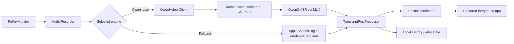

# Architecture

Flowtype is a SwiftPM macOS executable with a local Python ASR helper. The public repository contains source and deterministic bundle assembly code; model weights and private release credentials are external.

## Dictation Flow

## Components

### Swift Application

`Sources/VoiceInputApp/` contains:

- `Input/` — `FnKeyMonitor` and the macOS event-tap boundary;
- `Audio/` — recording and input-device selection;
- `ASR/` — local Qwen client, Apple Speech, readiness, fallback, and provenance;
- `PostProcessing/` — confusion correction, terminology, numbers, filler cleanup, math parsing/rendering, and candidate decisions;
- `Paste/` — target capture, validation, pasteboard, and paste dispatch;
- `History/`, `Diagnostics/`, and `Stats/` — local persistence and support data;
- `Readiness/`, `Model/`, `Helper/`, and `Permissions/` — model/runtime preparation and system boundaries;
- SwiftUI/AppKit presentation under `MainWindow/`, `Onboarding/`, `Settings/`, and `Overlay/`.

### Qwen Helper

`Helpers/qwen-asr-helper/` is a uv-managed Python project. The app launches it on loopback with a dynamic port and session token. The helper owns model download/status and MLX inference. It does not expose a public network service.

### Post-Processing

The transcript pipeline is staged rather than one large rewrite:

1. ASR confusion correction with protected known terms.
2. Technical-term normalization.
3. Optional number normalization.
4. Optional filler cleanup.
5. Optional math parsing and Unicode/LaTeX rendering.
6. Candidate scoring and final whitespace cleanup.

This separation is important for regression tests and for tracing why a spoken phrase changed.

### Packaging

`config/app-bundle-contract.json` is the canonical static bundle inventory. `script/app_bundle.py` assembles and verifies the app bundle; `Makefile` and `script/build_and_run.sh` are adapters around that contract.

The public source projection is generated from a committed private source ref through an explicit allowlist. The public repository must not inherit private Git history.

## Trust Boundaries

- Microphone input enters the Swift app.
- Qwen audio crosses only the loopback helper boundary.
- Model and dependency download operations cross the network boundary explicitly.
- Accessibility and pasteboard APIs cross the macOS automation boundary.
- Local history, recordings, models, helper runtime, and diagnostics cross the filesystem persistence boundary.
- Signing and notarization credentials belong only to the release environment and are never repository inputs.
